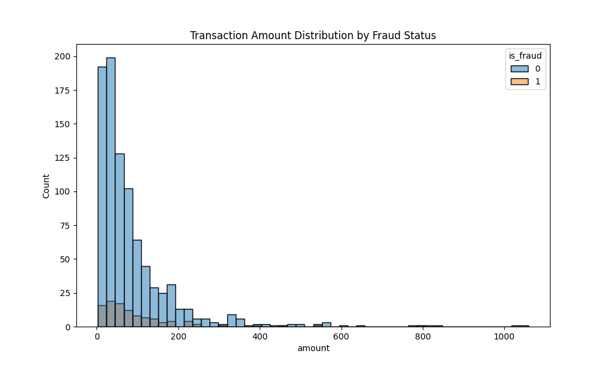
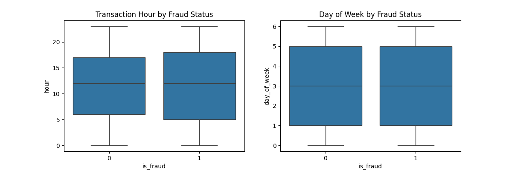
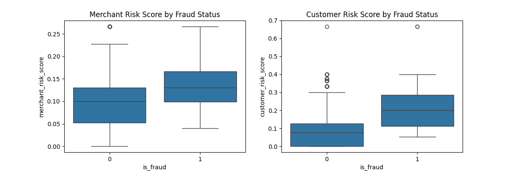
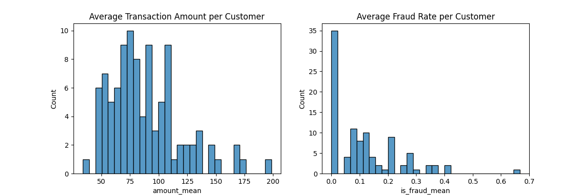

# AI-Powered Financial Fraud Detection Solution

## Overview
This project implements an end-to-end AI-powered financial fraud detection system that leverages both traditional machine learning and advanced Large Language Models (LLMs) to identify and prevent fraudulent transactions in real-time. The solution combines the power of OpenAI's GPT models with traditional ML approaches to provide comprehensive fraud detection capabilities.

## Key Features
- Real-time transaction monitoring and fraud detection
- Advanced feature engineering for fraud pattern recognition
- Multiple ML model support (XGBoost, LightGBM, Random Forest)
- LLM-powered transaction analysis and anomaly detection
- Natural language processing for fraud pattern identification
- Automated fraud investigation and reporting
- Model monitoring and drift detection
- Cloud-native architecture with AWS integration
- Comprehensive logging and monitoring
- RESTful API for integration

## AI/LLM Integration

### OpenAI Integration
- **Transaction Analysis**:
  - Natural language understanding of transaction descriptions
  - Pattern recognition in merchant names and locations
  - Contextual analysis of transaction sequences
  - Anomaly detection in transaction narratives

- **Fraud Investigation**:
  - Automated report generation
  - Natural language explanations of fraud alerts
  - Historical pattern analysis
  - Risk assessment summaries

- **Customer Communication**:
  - Automated fraud alert notifications
  - Natural language responses to customer queries
  - Personalized security recommendations
  - Multi-language support

### LLM Capabilities
- **Transaction Classification**:
  - Categorization of transactions using natural language
  - Identification of suspicious patterns
  - Context-aware risk assessment
  - Behavioral pattern recognition

- **Document Analysis**:
  - Processing of financial documents
  - Extraction of relevant information
  - Verification of document authenticity
  - Cross-reference with transaction data

- **Risk Assessment**:
  - Natural language risk scoring
  - Contextual analysis of customer behavior
  - Historical pattern matching
  - Real-time risk level adjustment

### Integration Architecture
- **API Layer**:
  - OpenAI API integration
  - Rate limiting and cost management
  - Response caching
  - Fallback mechanisms

- **Processing Pipeline**:
  - Text preprocessing
  - Context enrichment
  - Response validation
  - Result aggregation

- **Security Measures**:
  - Data encryption
  - PII handling
  - Access control
  - Audit logging

## Core Components

### Dataiku DSS Integration
The project leverages Dataiku DSS for data processing and model development:

#### Custom Plugins
- **Feature Engineering Plugin**: Processes transaction data to create meaningful features
  - Time-based features (hour, day of week, weekend indicators)
  - Amount-based features (log transform, z-scores)
  - Behavioral features (transaction frequency, velocity)
  - Risk scores (merchant, customer, location)
- **Model Training Plugin**: Implements multiple ML models
  - XGBoost with hyperparameter tuning
  - LightGBM for fast training
  - Random Forest for interpretability
  - Gradient Boosting for ensemble learning
- **Model Monitoring Plugin**: Tracks model performance and data drift
  - Statistical drift detection
  - Performance metrics tracking
  - Feature importance monitoring
  - Automated retraining triggers

#### Dataiku Flows
- **Data Processing Flow**: Handles data ingestion and preprocessing
- **Model Training Flow**: Orchestrates model training and evaluation
- **Monitoring Flow**: Manages model monitoring and alerts
- **Deployment Flow**: Handles model deployment and versioning

### Infrastructure as Code (Terraform)

#### AWS Infrastructure
- **Compute Resources**:
  - EC2 instances for model serving
  - EKS cluster for containerized deployment
  - Lambda functions for serverless components
- **Storage**:
  - S3 buckets for data and model artifacts
  - EFS for shared storage
  - RDS for metadata storage
- **Networking**:
  - VPC with public and private subnets
  - Security groups and NACLs
  - Application Load Balancer
- **Security**:
  - IAM roles and policies
  - KMS for encryption
  - Secrets Manager for credentials

#### Terraform Modules
- **Network Module**: VPC and networking components
- **Compute Module**: EC2 and EKS resources
- **Storage Module**: S3 and RDS configurations
- **Security Module**: IAM and security settings
- **Monitoring Module**: CloudWatch and logging setup

### GitHub Actions Workflows

#### CI/CD Pipeline
- **Code Quality**:
  - Linting (flake8, black)
  - Type checking (mypy)
  - Unit test execution
  - Integration test validation
- **Security Scanning**:
  - Dependency vulnerability checks
  - Code security analysis
  - Container scanning
  - Infrastructure security validation
- **Deployment**:
  - Automated testing
  - Infrastructure validation
  - Staging deployment
  - Production deployment

#### Automated Workflows
- **Pull Request Validation**:
  - Code review automation
  - Test coverage reporting
  - Documentation updates
- **Release Management**:
  - Version tagging
  - Changelog generation
  - Release notes
- **Monitoring**:
  - Performance testing
  - Load testing
  - Health checks

## Project Structure
```
.
├── application/              # Main application code
│   ├── src/                 # Source code
│   ├── tests/              # Application tests
│   ├── Dockerfile          # Container definition
│   └── requirements.txt    # Python dependencies
├── dataiku/                 # Dataiku DSS integration
│   ├── plugins/            # Custom Dataiku plugins
│   ├── flows/              # Dataiku flow definitions
│   ├── tests/              # Test suites
│   ├── plots/              # Generated plots
│   ├── test_flow.py        # Test flow implementation
│   └── requirements.txt    # Python dependencies
├── infrastructure/          # Infrastructure as Code
│   ├── modules/            # Terraform modules
│   ├── main.tf             # Main Terraform configuration
│   ├── variables.tf        # Terraform variables
│   ├── outputs.tf          # Terraform outputs
│   ├── validate.tf         # Validation rules
│   └── terraform.tfvars    # Variable values
├── scripts/                 # Utility scripts
├── docs/                    # Documentation
├── .github/                 # GitHub workflows and templates
└── tests/                   # Global test suites
```

## Prerequisites
- Python 3.8+
- AWS Account with appropriate permissions
- OpenAI API key
- Terraform 1.0+
- Docker
- Dataiku DSS (optional, for development)

## Installation

1. Clone the repository:
```bash
git clone https://github.com/pxkundu/ai-financial-fraud-detection-solution.git
cd ai-financial-fraud-detection-solution
```

2. Create and activate a virtual environment:
```bash
python -m venv venv
source venv/bin/activate  # On Windows: venv\Scripts\activate
```

3. Install dependencies:
```bash
pip install -r requirements.txt
```

4. Set up environment variables:
```bash
# Create .env file
cp .env.example .env

# Add your OpenAI API key
echo "OPENAI_API_KEY=your_api_key_here" >> .env
```

5. Set up AWS credentials:
```bash
aws configure
```

## Usage

### Running the Application
1. Start the API server:
```bash
python application/src/main.py
```

2. Access the API documentation at `http://localhost:8000/docs`

### Testing LLM Integration
```bash
# Test OpenAI integration
python tests/test_llm_integration.py

# Test fraud detection with LLM
python tests/test_fraud_detection.py
```

### Running Tests
```bash
python -m pytest tests/
```

### Deploying Infrastructure
```bash
cd infrastructure/terraform
terraform init
terraform apply
```

## Components

### Feature Engineering
The system processes transaction data to create meaningful features:
- Time-based features (hour, day of week, weekend indicators)
- Amount-based features (log transform, z-scores)
- Behavioral features (transaction frequency, velocity)
- Risk scores (merchant, customer, location)

### Model Training
Multiple models are trained and evaluated:
- XGBoost
- LightGBM
- Random Forest
- Gradient Boosting

### Model Monitoring
Continuous monitoring of:
- Data drift detection
- Model performance metrics
- Prediction distributions
- Feature importance changes

### API Endpoints
- `/predict` - Real-time fraud prediction
- `/batch-predict` - Batch prediction processing
- `/model/status` - Model health check
- `/model/metrics` - Performance metrics

## Development

### Adding New Features
1. Create a new branch:
```bash
git checkout -b feature/your-feature-name
```

2. Make your changes
3. Run tests:
```bash
python -m pytest tests/
```

4. Submit a pull request

### Code Style
- Follow PEP 8 guidelines
- Use type hints
- Write docstrings for all functions
- Include unit tests for new features

## Monitoring and Maintenance

### Logging
- Application logs are stored in CloudWatch
- Model performance metrics in CloudWatch Metrics
- Custom dashboards available in Grafana

### Alerts
- Model drift alerts
- Performance degradation alerts
- System health alerts

## Security
- All API endpoints are secured with JWT authentication
- Sensitive data is encrypted at rest
- Network traffic is encrypted in transit
- Regular security audits and updates

## Contributing
1. Fork the repository
2. Create your feature branch
3. Commit your changes
4. Push to the branch
5. Create a Pull Request

## License
This project is licensed under the MIT License - see the LICENSE file for details.

## Support
For support, please open an issue in the GitHub repository or contact the maintainers.

## Acknowledgments
- AWS for cloud infrastructure
- Dataiku for DSS integration
- Open source ML libraries
- Contributors and maintainers

## Test Output

The following plots were generated during the Dataiku feature engineering tests:

### Transaction Amount Distribution


### Time-based Features


### Risk Score Distribution


### Customer Statistics

