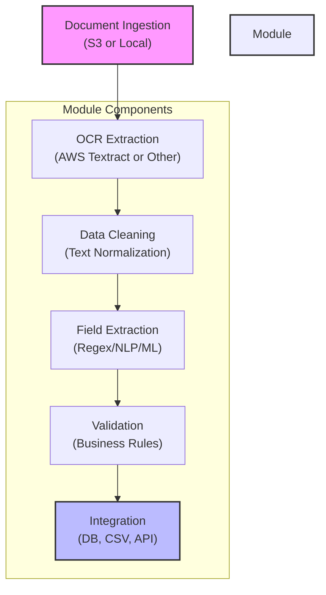

# Bill of Lading Automation Module

## Overview
This module provides a standalone, pluggable workflow for automating the extraction, validation, and integration of Bill of Lading documents. It is designed to be deployed independently and integrated into any data platform solution, supporting both cloud and on-premises environments.

## Features
- Document ingestion from cloud or local storage
- OCR extraction (default: AWS Textract, pluggable for other engines)
- Data cleaning and normalization
- Structured field extraction (shipment ID, date, carrier, consignee, items, etc.)
- Validation and business rule checks
- Integration with databases, APIs, or files
- Configurable and extensible via YAML/JSON
- Deployable as a Dataiku plugin, CLI tool, or API microservice

## Architecture
```
Ingestion -> OCR Extraction -> Data Cleaning -> Field Extraction -> Validation -> Integration
```
Each step is modular and can be customized or replaced as needed.

## Quickstart
1. Configure endpoints, field mappings, and validation rules in `config/sample_config.yaml`.
2. Install dependencies: `pip install -r requirements.txt`
3. Run the workflow via Dataiku, CLI, or API (see deployment instructions).

## Extensibility
- Swap OCR engines by updating the config and utility modules.
- Add new field extraction or validation logic as needed.
- Integrate with any downstream system via the integration step.

## Documentation
See `deployment/deploy_instructions.md` for setup and usage details.

## System Architecture & Activity Flow

### Interactive Architecture Diagram



### Complete System Activity Flow

1. **Document Ingestion**
   - Monitors a cloud bucket (S3) or local directory for new Bill of Lading documents (PDF, image, scan).
   - Ingests document metadata and prepares for processing.

2. **OCR Extraction**
   - Uses AWS Textract (or a pluggable OCR engine) to extract text, tables, and key-value pairs from each document.
   - Stores raw OCR output for downstream processing.

3. **Data Cleaning**
   - Cleans and normalizes extracted text (removes noise, standardizes whitespace, handles multi-page docs).
   - Prepares data for structured extraction.

4. **Field Extraction**
   - Applies regex, NLP, or ML models to extract structured fields (shipment ID, date, carrier, consignee, items, weights, etc.).
   - Handles both single-value fields and tables (line items).

5. **Validation**
   - Checks for required fields, correct formats, duplicates, and applies business rules as defined in the config.
   - Flags errors or missing data for review.

6. **Integration**
   - Outputs validated, structured data to the configured destination (database, CSV, or API endpoint).
   - Optionally triggers downstream workflows or notifications.

### How the Components Interact
- Each step is modular and can be run independently or as part of a Dataiku flow.
- Configuration is centralized in a YAML file, making the system flexible and easy to adapt.
- The module can be deployed as a Dataiku plugin, CLI tool, or microservice, and integrates with any data platform.

**This architecture ensures scalability, maintainability, and ease of integration for any data-driven organization.** 