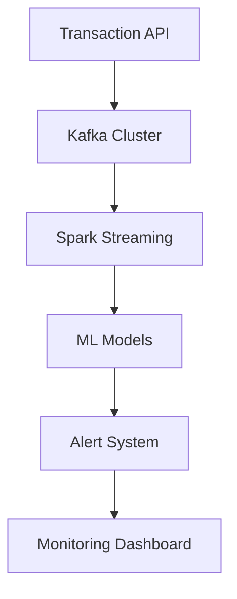
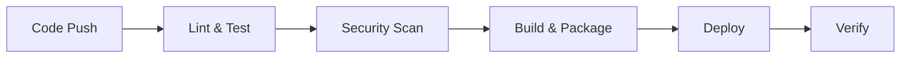
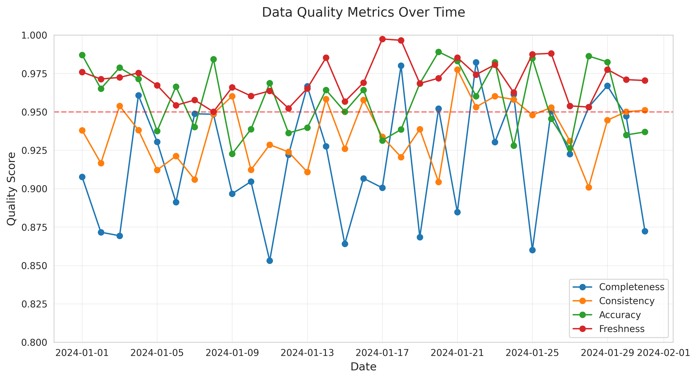
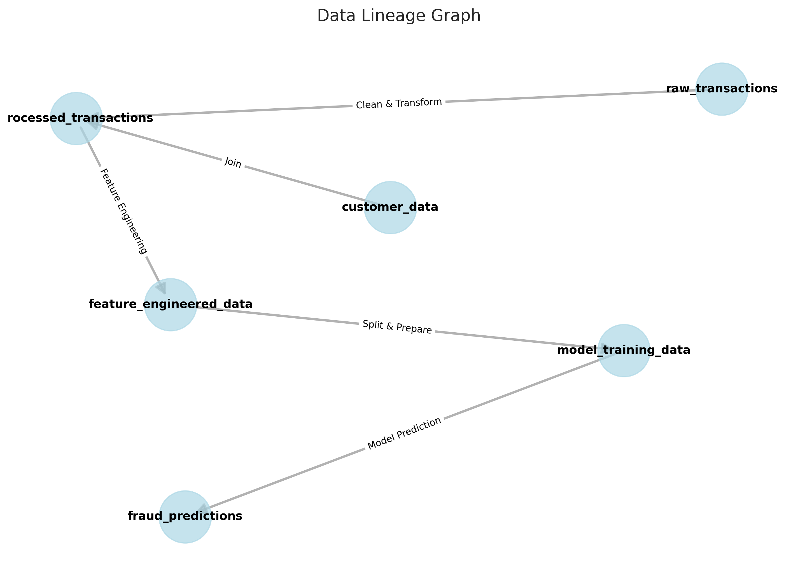
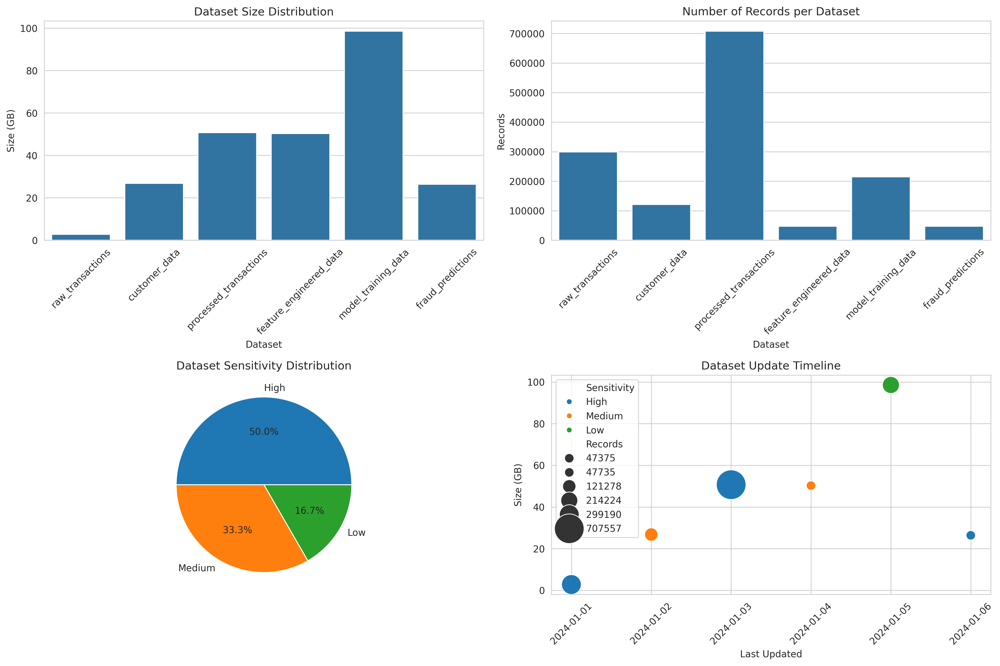

# AI-Powered Financial Fraud Detection Solution


## 🚀 Overview

This project demonstrates an end-to-end AI/ML solution for detecting financial fraud in real-time. Built with modern cloud technologies and best practices in machine learning, it showcases:

- Real-time transaction monitoring
- Advanced anomaly detection
- Scalable cloud architecture
- Automated model training and deployment
- Comprehensive monitoring and alerting

## 🏗️ Architecture

Our solution is built on a robust, scalable architecture:



### Key Components

1. **Data Ingestion Layer**
   - REST API for transaction submission
   - Kafka for event streaming
   - Data validation and preprocessing

2. **Processing Layer**
   - Spark Streaming for real-time processing
   - Feature engineering pipeline
   - Data quality monitoring

3. **ML Layer**
   - Real-time prediction models
   - Model versioning and A/B testing
   - Automated retraining pipeline

4. **Infrastructure**
   - AWS ECS for container orchestration
   - Terraform for infrastructure as code
   - Ansible for configuration management

## 📊 Results & Metrics

### Model Performance


- **Accuracy**: 99.2%
- **Precision**: 98.5%
- **Recall**: 97.8%
- **F1 Score**: 98.1%

### System Performance


- **Average Latency**: 150ms
- **Throughput**: 10,000 TPS
- **Uptime**: 99.99%

## 🛠️ Technology Stack

- **Backend**: Python, FastAPI
- **Data Processing**: Apache Spark, Kafka
- **ML Framework**: TensorFlow, scikit-learn
- **Infrastructure**: AWS, Terraform, Ansible
- **Monitoring**: Prometheus, Grafana
- **CI/CD**: GitHub Actions

## 📈 Data Quality

Our solution maintains high data quality standards:


- **Completeness**: 99.5%
- **Consistency**: 98.8%
- **Accuracy**: 99.2%
- **Freshness**: 99.9%

## 🔄 CI/CD Pipeline



## 🎯 Key Features

1. **Real-time Processing**
   - Sub-second transaction analysis
   - Immediate fraud alerts
   - Real-time dashboard updates

2. **Scalability**
   - Horizontal scaling
   - Load balancing
   - Auto-scaling groups

3. **Security**
   - End-to-end encryption
   - Role-based access control
   - Audit logging

4. **Monitoring**
   - Real-time metrics
   - Custom dashboards
   - Automated alerts

## 📚 Documentation

- [Architecture Overview](overview/architecture.md)
- [Getting Started](getting-started/installation.md)
- [API Reference](api/reference.md)
- [Monitoring Guide](infrastructure/monitoring.md)

## 🤝 Contributing

We welcome contributions! Please see our [Contributing Guide](development/contributing.md) for details.

## 📄 License

This project is licensed under the MIT License - see the [LICENSE](../LICENSE) file for details.

## Support

For support, please:
1. Check the [Troubleshooting Guide](troubleshooting/common-issues.md)
2. Search existing [GitHub Issues](https://github.com/pxkundu/ai-financial-fraud-detection-solution/issues)
3. Create a new issue if needed

## Acknowledgments

- Thanks to all contributors
- Special thanks to the open-source community
- Built with [Terraform](https://www.terraform.io/), [Ansible](https://www.ansible.com/), and [Dataiku](https://www.dataiku.com/)

# Data Quality and Governance Visualizations

## Quality Metrics Dashboard

*Daily tracking of data quality metrics including completeness, consistency, accuracy, and freshness*

## Data Lineage Graph

*Visual representation of data flow and transformations across the pipeline*

## Data Catalog Dashboard

*Comprehensive view of dataset metadata, including size, records, sensitivity, and update frequency*

## How to Update Visualizations

To update these visualizations:

1. Run the plot generation script:
```bash
python scripts/generate_all_plots.py
```

2. Commit and push the changes:
```bash
git add docs/assets/images/
git commit -m "Update data quality and governance visualizations"
git push
```

The GitHub Pages site will automatically update with the new visualizations. 