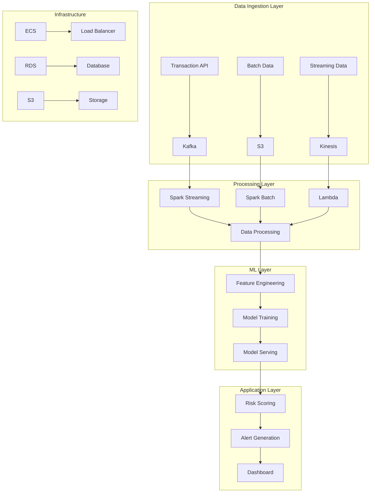
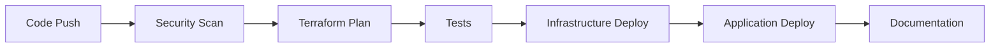
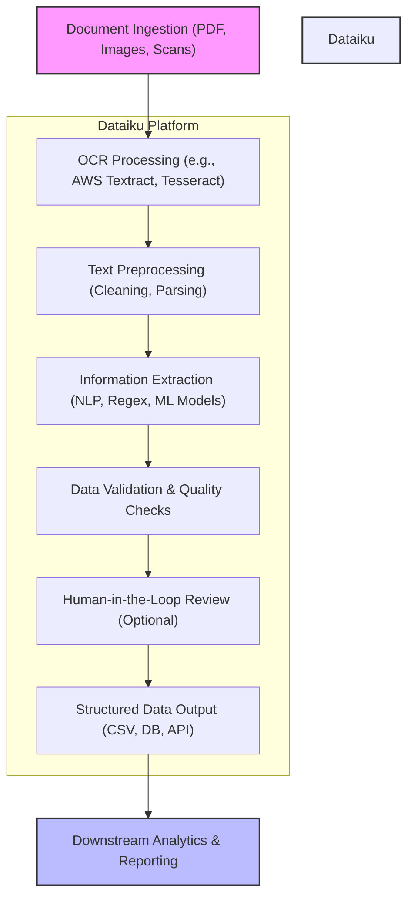

# System Architecture

## High-Level Architecture



## Component Details

### 1. Data Ingestion Layer

#### Transaction API
- RESTful API endpoints
- WebSocket support
- Rate limiting
- Authentication
- Request validation

#### Kafka Cluster
- Topic partitioning
- Message persistence
- Consumer groups
- Replication
- Monitoring

#### S3 Storage
- Data lake structure
- Lifecycle policies
- Versioning
- Encryption
- Access control

### 2. Processing Layer

#### Spark Streaming
- Real-time processing
- Micro-batch processing
- State management
- Fault tolerance
- Scaling

#### Spark Batch
- Scheduled jobs
- Data transformation
- Feature computation
- Data quality checks
- Performance optimization

#### Lambda Functions
- Event processing
- Data validation
- Alert generation
- Integration points
- Cost optimization

### 3. Machine Learning Layer

#### Feature Engineering
- Feature extraction
- Feature selection
- Feature scaling
- Feature validation
- Feature monitoring

#### Model Training
- Automated training
- Hyperparameter tuning
- Model validation
- Performance metrics
- Version control

#### Model Serving
- Real-time inference
- Batch prediction
- Model versioning
- A/B testing
- Performance monitoring

### 4. Application Layer

#### Risk Scoring
- Real-time scoring
- Batch scoring
- Score calibration
- Threshold management
- Performance tracking

#### Alert Generation
- Alert rules
- Alert prioritization
- Alert routing
- Alert tracking
- Alert resolution

#### Dashboard
- Real-time monitoring
- Historical analysis
- Performance metrics
- User management
- Customization

## Infrastructure Components

### 1. Compute Resources

#### ECS Clusters
- Service auto-scaling
- Load balancing
- Health checks
- Rolling updates
- Resource optimization

#### Lambda Functions
- Event-driven execution
- Pay-per-use pricing
- Automatic scaling
- Integration points
- Monitoring

### 2. Storage

#### RDS Database
- High availability
- Automated backups
- Performance optimization
- Security groups
- Monitoring

#### S3 Storage
- Data lake
- Backup storage
- Log storage
- Artifact storage
- Static content

### 3. Networking

#### VPC Configuration
- Subnet design
- Security groups
- NACLs
- VPC endpoints
- Peering

#### Load Balancers
- Application load balancer
- Network load balancer
- SSL termination
- Health checks
- Sticky sessions

## Security Architecture

### 1. Authentication & Authorization

- IAM roles and policies
- Cognito user pools
- API Gateway authorizers
- Resource-based policies
- MFA support

### 2. Data Security

- Encryption at rest
- Encryption in transit
- Key management
- Data masking
- Access logging

### 3. Network Security

- Security groups
- NACLs
- WAF rules
- DDoS protection
- VPN access

## Monitoring & Logging

### 1. Application Monitoring

- CloudWatch metrics
- Custom dashboards
- Alarms
- Log aggregation
- Performance tracking

### 2. Infrastructure Monitoring

- Resource utilization
- Cost monitoring
- Capacity planning
- Health checks
- Automated recovery

### 3. Security Monitoring

- Security events
- Compliance checks
- Threat detection
- Incident response
- Audit logging

## Deployment Architecture

### 1. CI/CD Pipeline



### 2. Environment Strategy

- Development
- Staging
- Production
- DR site
- Testing

### 3. Deployment Strategy

- Blue-green deployment
- Canary releases
- Rolling updates
- Rollback procedures
- Version control

## Scalability & Performance

### 1. Horizontal Scaling

- Auto-scaling groups
- Load balancing
- Database scaling
- Cache scaling
- Storage scaling

### 2. Performance Optimization

- Caching strategy
- Database optimization
- Query optimization
- Resource optimization
- Cost optimization

### 3. High Availability

- Multi-AZ deployment
- Failover testing
- Disaster recovery
- Backup strategy
- Recovery procedures

## Next Steps

- [Feature Documentation](features.md)
- [Getting Started Guide](../getting-started/prerequisites.md)
- [Development Guide](../development/guide.md)
- [API Documentation](../api/reference.md)
- [Troubleshooting Guide](../troubleshooting/common-issues.md)

## Intelligent Document Processing (IDP) Solution Design with Dataiku

### How Dataiku Helps in IDP Solution Design

Dataiku provides a unified platform to design, build, and monitor Intelligent Document Processing (IDP) solutions. Here's how Dataiku supports each stage of the IDP workflow:

1. **End-to-End Workflow Orchestration**
   - Visual flows for document ingestion, OCR, extraction, validation, and analytics.
   - Automation and scheduling for efficient, consistent processing.
2. **Integration with OCR and NLP Tools**
   - Connects to OCR engines (AWS Textract, Tesseract, etc.) and NLP libraries.
   - Supports API calls to external document processing services.
3. **Custom Preprocessing and Extraction**
   - Custom Python/R recipes for advanced text cleaning, entity extraction, and table parsing.
   - Reusable plugins for scalable, consistent logic.
4. **Data Quality and Validation**
   - Built-in and custom checks for data completeness, format, and accuracy.
   - Human-in-the-loop review steps for manual validation.
5. **Machine Learning for Classification and Extraction**
   - Train and deploy ML models for document classification and information extraction.
   - Use AutoML for rapid prototyping and model comparison.
6. **Scalability and Integration**
   - Deploy on cloud or on-prem, scale as document volume grows.
   - Integrate with databases, cloud storage, and business apps.
7. **Monitoring and Governance**
   - Dashboards for monitoring processing volumes, error rates, and model performance.
   - Audit trails for compliance and traceability.

### Sample IDP Architecture in Dataiku



**How to read this diagram:**
- Documents are ingested (PDFs, images, scans).
- OCR is performed (using AWS Textract, Tesseract, etc.).
- Text is cleaned and parsed.
- Information is extracted using NLP, regex, or ML models.
- Data is validated and quality-checked.
- Optionally, a human reviews/corrects the extracted data.
- Structured data is output to files, databases, or APIs.
- Data is used for downstream analytics and reporting.

All the core processing steps are orchestrated and automated within Dataiku.

### Core Value Dataiku Brings to IDP

- **Faster Prototyping:** Rapidly build and iterate on IDP workflows without heavy coding.
- **Collaboration:** Data scientists, business analysts, and IT can work together in one platform.
- **Transparency:** Visual flows and dashboards make it easy to understand and audit the process.
- **Flexibility:** Combine no-code, low-code, and full-code approaches as needed.
- **Scalability:** Easily move from prototype to production, handling large document volumes.

Dataiku accelerates time-to-value and ensures high quality and compliance for IDP solutions.

### Step-by-Step Example: Invoice Processing Workflow in Dataiku

1. **Document Ingestion**
   - PDF or scanned image invoices are uploaded to cloud storage (e.g., AWS S3).
   - Dataiku detects and imports new files automatically.
2. **OCR Processing**
   - Dataiku calls an OCR service (e.g., AWS Textract, Tesseract) to extract text and tables from invoices.
3. **Text Preprocessing**
   - Clean and parse extracted text: remove noise, normalize formats, split multi-page invoices.
4. **Information Extraction**
   - Use NLP, regex, or ML models to extract key fields: invoice number, date, vendor, line items, totals, etc.
5. **Data Validation & Quality Checks**
   - Validate required fields, check formats, flag duplicates or outliers using Dataiku plugins or custom checks.
6. **Human-in-the-Loop Review (Optional)**
   - Route flagged or low-confidence invoices to a Dataiku webapp or review workflow for manual correction.
7. **Structured Data Output**
   - Write validated data to a database, CSV, or push to an ERP/accounting system via API.
8. **Downstream Analytics & Reporting**
   - Use Dataiku dashboards or export data for spend analysis, vendor performance, compliance, and audit reporting.

#### Visual Summary

```mermaid
flowchart TD
    A[Invoice Upload (PDF/Image)] --> B[OCR Extraction (Textract/Tesseract)]
    B --> C[Text Cleaning & Parsing]
    C --> D[Key Field Extraction (NLP/Regex/ML)]
    D --> E[Validation & Quality Checks]
    E --> F[Human Review (Optional)]
    F --> G[Structured Output (DB/CSV/API)]
    G --> H[Analytics & Reporting]
    subgraph Dataiku Platform
        B
        C
        D
        E
        F
        G
    end
```

This workflow can be fully orchestrated and automated in Dataiku, combining visual flows, custom code, and integrations for a robust, scalable invoice processing solution. 