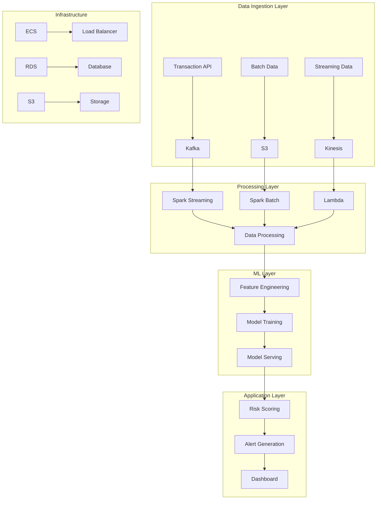
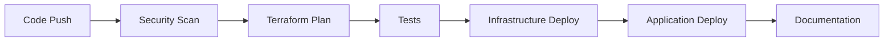

# System Architecture

## High-Level Architecture

## Component Details

### 1. Data Ingestion Layer

#### Transaction API
- RESTful API endpoints
- WebSocket support
- Rate limiting
- Authentication
- Request validation

#### Kafka Cluster
- Topic partitioning
- Message persistence
- Consumer groups
- Replication
- Monitoring

#### S3 Storage
- Data lake structure
- Lifecycle policies
- Versioning
- Encryption
- Access control

### 2. Processing Layer

#### Spark Streaming
- Real-time processing
- Micro-batch processing
- State management
- Fault tolerance
- Scaling

#### Spark Batch
- Scheduled jobs
- Data transformation
- Feature computation
- Data quality checks
- Performance optimization

#### Lambda Functions
- Event processing
- Data validation
- Alert generation
- Integration points
- Cost optimization

### 3. Machine Learning Layer

#### Feature Engineering
- Feature extraction
- Feature selection
- Feature scaling
- Feature validation
- Feature monitoring

#### Model Training
- Automated training
- Hyperparameter tuning
- Model validation
- Performance metrics
- Version control

#### Model Serving
- Real-time inference
- Batch prediction
- Model versioning
- A/B testing
- Performance monitoring

### 4. Application Layer

#### Risk Scoring
- Real-time scoring
- Batch scoring
- Score calibration
- Threshold management
- Performance tracking

#### Alert Generation
- Alert rules
- Alert prioritization
- Alert routing
- Alert tracking
- Alert resolution

#### Dashboard
- Real-time monitoring
- Historical analysis
- Performance metrics
- User management
- Customization

## Infrastructure Components

### 1. Compute Resources

#### ECS Clusters
- Service auto-scaling
- Load balancing
- Health checks
- Rolling updates
- Resource optimization

#### Lambda Functions
- Event-driven execution
- Pay-per-use pricing
- Automatic scaling
- Integration points
- Monitoring

### 2. Storage

#### RDS Database
- High availability
- Automated backups
- Performance optimization
- Security groups
- Monitoring

#### S3 Storage
- Data lake
- Backup storage
- Log storage
- Artifact storage
- Static content

### 3. Networking

#### VPC Configuration
- Subnet design
- Security groups
- NACLs
- VPC endpoints
- Peering

#### Load Balancers
- Application load balancer
- Network load balancer
- SSL termination
- Health checks
- Sticky sessions

## Security Architecture

### 1. Authentication & Authorization

- IAM roles and policies
- Cognito user pools
- API Gateway authorizers
- Resource-based policies
- MFA support

### 2. Data Security

- Encryption at rest
- Encryption in transit
- Key management
- Data masking
- Access logging

### 3. Network Security

- Security groups
- NACLs
- WAF rules
- DDoS protection
- VPN access

## Monitoring & Logging

### 1. Application Monitoring

- CloudWatch metrics
- Custom dashboards
- Alarms
- Log aggregation
- Performance tracking

### 2. Infrastructure Monitoring

- Resource utilization
- Cost monitoring
- Capacity planning
- Health checks
- Automated recovery

### 3. Security Monitoring

- Security events
- Compliance checks
- Threat detection
- Incident response
- Audit logging

## Deployment Architecture

### 1. CI/CD Pipeline

### 2. Environment Strategy

- Development
- Staging
- Production
- DR site
- Testing

### 3. Deployment Strategy

- Blue-green deployment
- Canary releases
- Rolling updates
- Rollback procedures
- Version control

## Scalability & Performance

### 1. Horizontal Scaling

- Auto-scaling groups
- Load balancing
- Database scaling
- Cache scaling
- Storage scaling

### 2. Performance Optimization

- Caching strategy
- Database optimization
- Query optimization
- Resource optimization
- Cost optimization

### 3. High Availability

- Multi-AZ deployment
- Failover testing
- Disaster recovery
- Backup strategy
- Recovery procedures

## Next Steps

- [Feature Documentation](features.md)
- [Getting Started Guide](../getting-started/prerequisites.md)
- [Development Guide](../development/guide.md)
- [API Documentation](../api/reference.md)
- [Troubleshooting Guide](../troubleshooting/common-issues.md) 