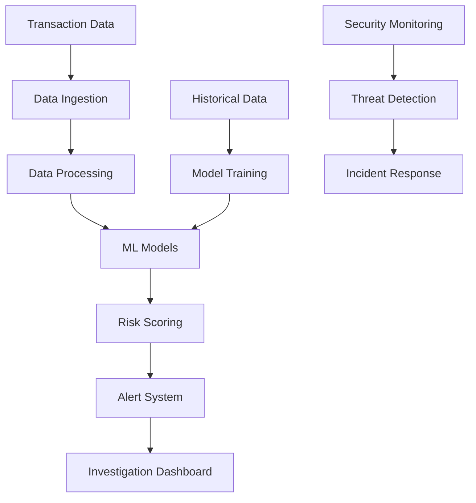

# Introduction

## Project Overview

The AI Financial Fraud Detection Solution is a comprehensive system designed to detect and prevent financial fraud using advanced machine learning techniques. The solution combines real-time transaction monitoring, historical pattern analysis, and predictive modeling to identify potential fraudulent activities.

## Key Components

### 1. Machine Learning Pipeline
- Real-time transaction analysis
- Historical pattern recognition
- Anomaly detection
- Risk scoring system
- Model retraining pipeline

### 2. Infrastructure
- Scalable AWS infrastructure
- Containerized microservices
- High-availability architecture
- Automated scaling
- Disaster recovery

### 3. Data Processing
- Real-time data ingestion
- Data quality monitoring
- Data governance
- Data lineage tracking
- Compliance reporting

### 4. Security
- End-to-end encryption
- Role-based access control
- Audit logging
- Security monitoring
- Compliance controls

## Architecture Overview



## Key Features

### 1. Real-time Detection
- Sub-second transaction analysis
- Pattern recognition
- Anomaly detection
- Risk scoring
- Alert generation

### 2. Machine Learning Capabilities
- Multiple model types
- Automated retraining
- Model versioning
- Performance monitoring
- A/B testing support

### 3. Data Management
- Data quality monitoring
- Data lineage tracking
- Compliance reporting
- Audit logging
- Data retention management

### 4. Security & Compliance
- End-to-end encryption
- Role-based access control
- Audit logging
- Compliance reporting
- Security monitoring

### 5. Integration Capabilities
- REST API
- Webhook support
- Event streaming
- Batch processing
- Real-time updates

## Technology Stack

### Infrastructure
- AWS (ECS, RDS, S3)
- Terraform
- Ansible
- Docker
- Kubernetes

### Data Processing
- Apache Spark
- Apache Kafka
- Dataiku
- Python
- SQL

### Machine Learning
- TensorFlow
- PyTorch
- Scikit-learn
- XGBoost
- Pandas

### Monitoring & Logging
- CloudWatch
- Prometheus
- Grafana
- ELK Stack
- Datadog

## Getting Started

1. Clone the repository:
   ```bash
   git clone https://github.com/pxkundu/ai-financial-fraud-detection-solution.git
   ```

2. Install dependencies:
   ```bash
   pip install -r requirements.txt
   ```

3. Configure environment:
   ```bash
   cp .env.example .env
   # Edit .env with your configuration
   ```

4. Deploy infrastructure:
   ```bash
   terraform init
   terraform plan
   terraform apply
   ```

5. Deploy application:
   ```bash
   ansible-playbook -i inventory/hosts playbooks/deploy.yml
   ```

## Documentation Structure

- [Architecture Details](architecture.md)
- [Feature Documentation](features.md)
- [Getting Started Guide](../getting-started/prerequisites.md)
- [Development Guide](../development/guide.md)
- [API Documentation](../api/reference.md)
- [Troubleshooting Guide](../troubleshooting/common-issues.md)

## Support and Resources

- [GitHub Repository](https://github.com/pxkundu/ai-financial-fraud-detection-solution)
- [Issue Tracker](https://github.com/pxkundu/ai-financial-fraud-detection-solution/issues)
- [Contributing Guide](../development/contributing.md)
- [Security Policy](../security.md) 